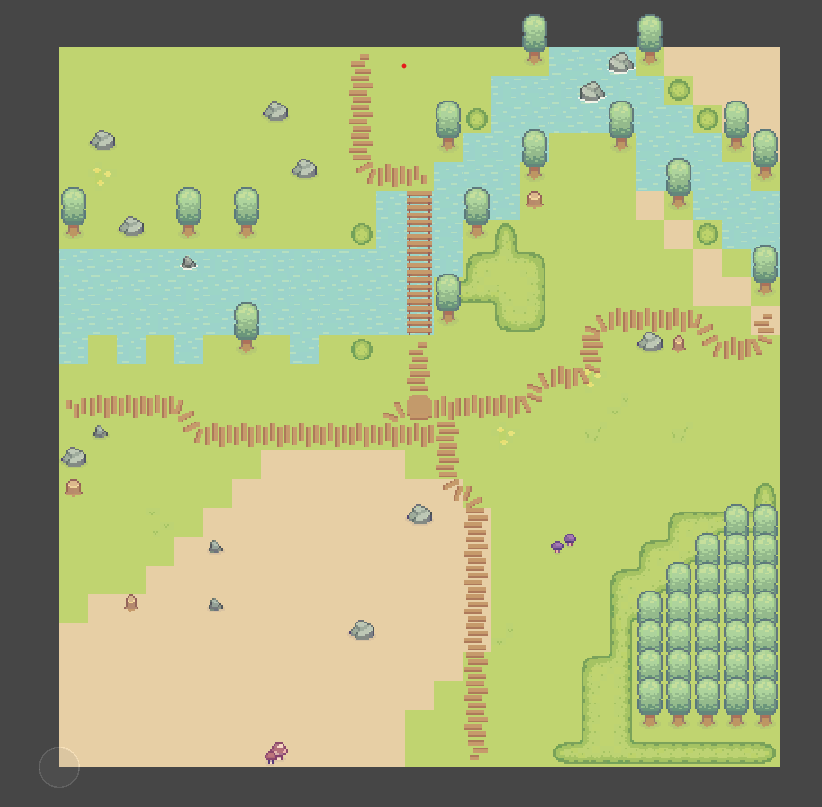
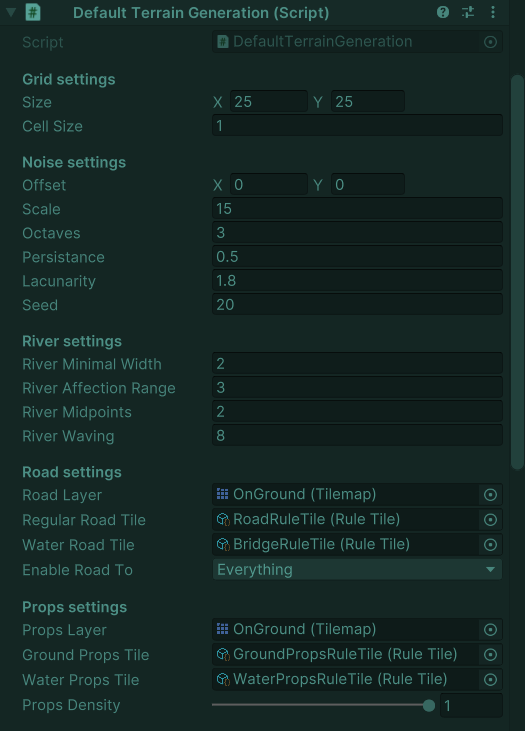
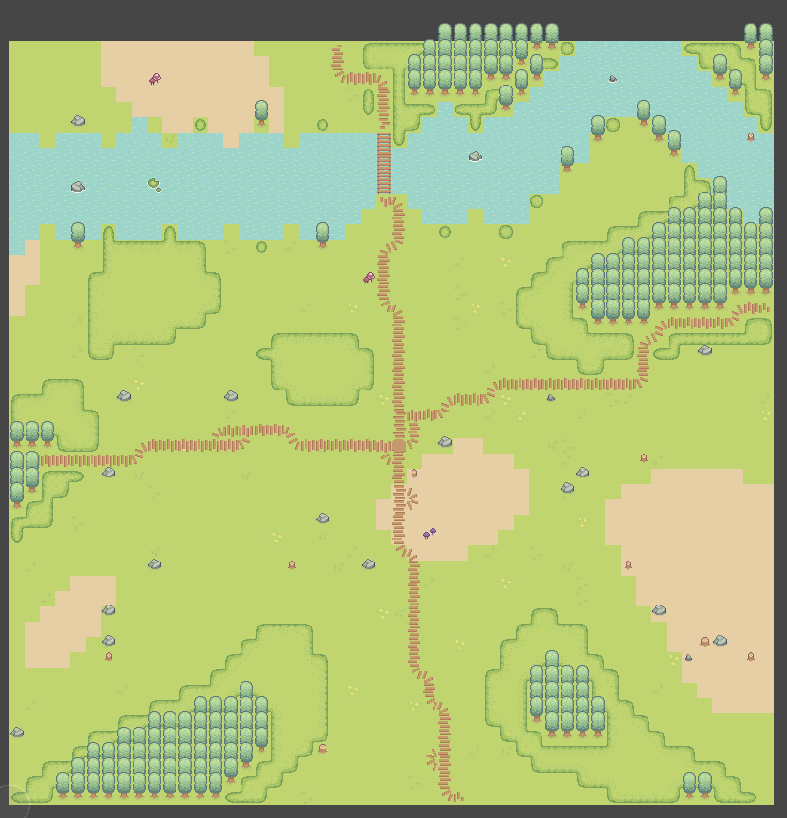
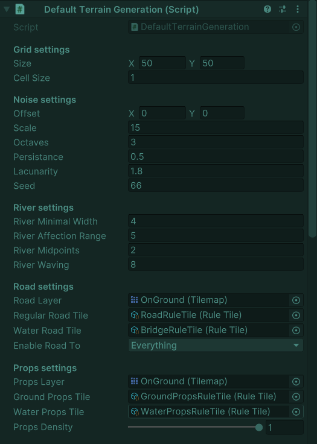

# Teren2D

Small project on procedural terrain generation in 2D
## Short Algorithm Description

* Noise map generated to form base terrain layout
* Noise values modified to for river
* Sample noise values on each point and place respective tile on tilemap. (Rule tiles used to make terrain more fluid)
* Footpath generated by modified random walk algorithm, same goes for props placing

## Screenshots
 

### Used graphic asset: https://cupnooble.itch.io/sprout-lands-asset-pack